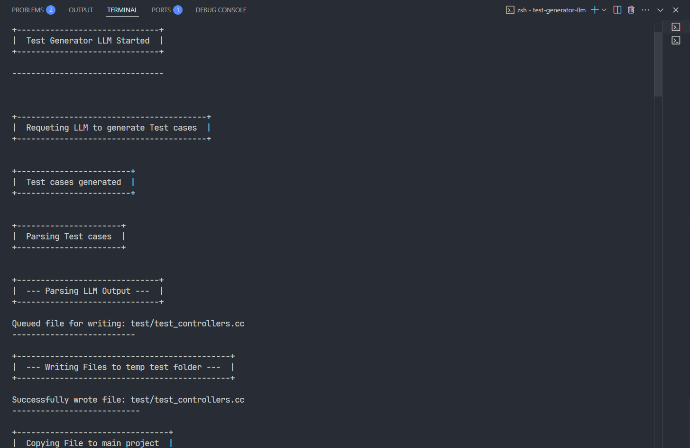
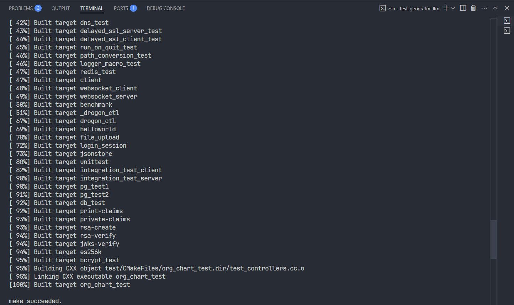
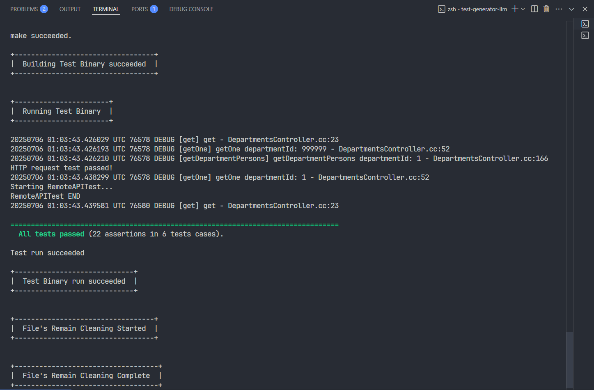
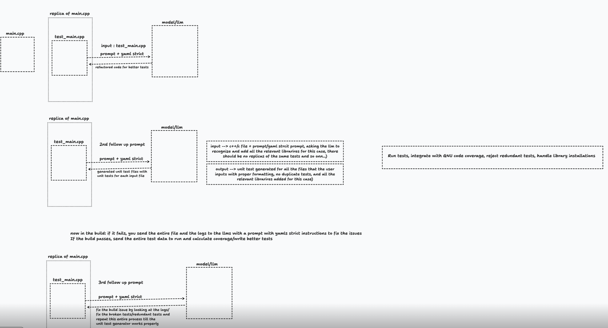

<h1 align="center">Test Generator LLM</h1>


<div align="center">
  <!--  -->
  
  <!-- <br> -->
  
  
</div>

<br>

> ### Use an LLM to generate test cases and execute them for validation.

We are using an LLM to generate unit tests for our code automatically. Once generated, the tests are run to check if they behave as expected and properly validate the functionality


## :computer: Tech Stack
- [**Go**](https://go.dev/) : Programming language
- [**Azure OpenAI/ChatGPT 4.1 Mini**](https://github.com/marketplace/models/azure-openai/gpt-4-1-mini): Utilized as the LLM backend to generate meaningful and contextual unit test cases for C++ code.
- [**CCP Project (orgChartApi)**](https://github.com/keploy/orgChartApi): The C++ project under test. The tool integrates with the CCP codebase to build the binary, generate test cases, and run them for validation.

<br>

## :book: How to Use / Run on Your Machine

- ### Prerequisites:
    - Install Go (version >= 1.23.3): https://golang.org/dl/
    - Setup the CCP Project locally (don't use docker to setup this project)
      - [Setup Instruction](https://github.com/keploy/orgChartApi?tab=readme-ov-file#%EF%B8%8F-manual-setup-without-docker)


> [!IMPORTANT]  
> I am using WSL (Ubuntu).

<br>

### :toolbox: Setup Project Locally:

- Clone the repository:
```sh
git clone https://github.com/saketv8/test-generator-llm.git
```

- Navigate to the project directory:
```sh
cd test-generator-llm
```
- Setup Env Variable:

> [!IMPORTANT]  
> get your own github personal access Token [Here](https://github.com/settings/tokens)

```sh
# rename <.env.example> to <.env>
# and
# set your own github_token

# sample
GITHUB_PAT=YOUR_GITHUB_PERSONAL_ACCESS_TOKEN_GOES_HERE
```

- Install dependencies:
```sh
go mod download
```

- Building the Application Binary:
```sh
go build -o test-generator-llm
```

- Starting the Application:
```sh
./test-generator-llm
```

- Check the terminal output
> :rocket: You're all set!

<br>

### :satellite: Terminal Output

<div align="center">
    
    
</div>

<br>

<div align="center">
    
</div>

<br>

> [!TIP]  
> All tests passed (-_-)


### 📊 Viewing Generated Test

> Check the `./test/` folder
>
> `It will only be generated after running the program`


<br>

### 🐳 Program Design (overview)
<div align="center">
    
</div>


<br>

### 🌸 Full terminal output

> Minor changes made to remove sensitive data
>
> This output may differ slightly from the images above, as it was regenerated after the screenshots were taken

```sh

+------------------------------+
|  Test Generator LLM Started  |
+------------------------------+

--------------------------------


+----------------------------------------+
|  Requeting LLM to generate Test cases  |
+----------------------------------------+


+------------------------+
|  Test cases generated  |
+------------------------+


+----------------------+
|  Parsing Test cases  |
+----------------------+


+------------------------------+
|  --- Parsing LLM Output ---  |
+------------------------------+

Queued file for writing: test/test_controllers.cc
--------------------------

+---------------------------------------------+
|  --- Writing Files to temp test folder ---  |
+---------------------------------------------+

Successfully wrote file: test/test_controllers.cc
---------------------------

+--------------------------------+
|  Copying File to main project  |
+--------------------------------+


+------------------------+
|  Building Test Binary  |
+------------------------+

Running: cmake .. -DBUILD_TESTING=ON
-- compiler: GNU
-- Could NOT find c-ares (missing: C-ARES_INCLUDE_DIRS C-ARES_LIBRARIES) 
-- Could NOT find GTest (missing: GTEST_LIBRARY GTEST_INCLUDE_DIR GTEST_MAIN_LIBRARY) 
-- Could NOT find Doxygen (missing: DOXYGEN_EXECUTABLE) 
-- Found std::filesystem
-- use c++17
CMake Warning (dev) at third_party/drogon/cmake_modules/FindJsoncpp.cmake:47 (exec_program):
  Policy CMP0153 is not set: The exec_program command should not be called.
  Run "cmake --help-policy CMP0153" for policy details.  Use the cmake_policy
  command to set the policy and suppress this warning.

  Use execute_process() instead.
Call Stack (most recent call first):
  third_party/drogon/CMakeLists.txt:204 (find_package)
This warning is for project developers.  Use -Wno-dev to suppress it.

-- jsoncpp verson:1.9.5
-- Found UUID: /usr/lib/x86_64-linux-gnu/libuuid.so
-- Could NOT find BROTLI (missing: BROTLIDEC_LIBRARY BROTLIENC_LIBRARY BROTLICOMMON_LIBRARY BROTLI_INCLUDE_DIR) 
-- pg inc: /usr/include/postgresql/usr/include/postgresql/16/server
-- libpq inc path:/usr/include/postgresql/usr/include/postgresql/16/server
-- libpq lib:/usr/lib/x86_64-linux-gnu/libpq.so
-- MySql was not found.
-- sqlite3 was not found.
-- Could NOT find Hiredis (missing: HIREDIS_LIBRARY HIREDIS_INCLUDE_DIR) 
-- view classname:test_main
-- bin:bin
-- Building tests
-- Could NOT find Doxygen (missing: DOXYGEN_EXECUTABLE) 
-- Found OpenSSL: /usr/lib/x86_64-linux-gnu/libcrypto.so (found suitable version "3.0.13", minimum required is "1.0.1")  
-- Could NOT find jsoncons (missing: jsoncons_DIR)
-- Could NOT find nlohmann_json (missing: nlohmann_json_DIR)
CMake Deprecation Warning at third_party/libbcrypt/CMakeLists.txt:14 (cmake_minimum_required):
  Compatibility with CMake < 3.5 will be removed from a future version of
  CMake.

  Update the VERSION argument <min> value or use a ...<max> suffix to tell
  CMake that the project does not need compatibility with older versions.


Building a static library
-- jsoncpp version:1.9.5
-- Found OpenSSL: /usr/lib/x86_64-linux-gnu/libcrypto.so (found version "3.0.13")  
-- Found UUID: /usr/lib/x86_64-linux-gnu/libuuid.so
-- pg inc: /usr/include/postgresql/usr/include/postgresql/16/server
-- use c++17
-- Configuring done (14.3s)
-- Generating done (0.2s)
-- Build files have been written to: /test-generator-llm/orgChartApi/build
cmake succeeded.
Running: make
[  8%] Built target trantor
[ 10%] Built target bcrypt
[ 11%] Building CXX object third_party/drogon/CMakeFiles/drogon.dir/lib/src/HttpAppFrameworkImpl.cc.o
[ 11%] Linking CXX static library libdrogon.a
[ 27%] Built target drogon
[ 27%] Linking CXX executable org_chart
[ 31%] Built target org_chart
[ 32%] Built target ssl_server_test
[ 33%] Built target ssl_client_test
[ 34%] Built target serial_task_queue_test1
[ 34%] Built target serial_task_queue_test2
[ 34%] Built target timer_test
[ 35%] Built target timer_test1
[ 35%] Built target run_in_loop_test1
[ 36%] Built target run_in_loop_test2
[ 37%] Built target logger_test
[ 38%] Built target async_file_logger_test
[ 39%] Built target tcp_server_test
[ 40%] Built target concurrent_task_queue_test
[ 40%] Built target tcp_client_test
[ 40%] Built target async_file_logger_test1
[ 40%] Built target sendfile_test
[ 41%] Built target timing_wheel_test
[ 42%] Built target kickoff_test
[ 42%] Built target dns_test
[ 43%] Built target delayed_ssl_server_test
[ 44%] Built target delayed_ssl_client_test
[ 45%] Built target run_on_quit_test
[ 46%] Built target path_conversion_test
[ 46%] Built target logger_macro_test
[ 47%] Linking CXX executable redis_test
[ 47%] Built target redis_test
[ 47%] Linking CXX executable client
[ 47%] Built target client
[ 47%] Linking CXX executable websocket_client
[ 48%] Built target websocket_client
[ 49%] Linking CXX executable websocket_server
[ 49%] Built target websocket_server
[ 50%] Linking CXX executable benchmark
[ 50%] Built target benchmark
[ 50%] Linking CXX executable _drogon_ctl
[ 51%] Built target _drogon_ctl
[ 52%] Building CXX object third_party/drogon/drogon_ctl/CMakeFiles/drogon_ctl.dir/version.cc.o
[ 53%] Linking CXX executable drogon_ctl
[ 67%] Built target drogon_ctl
[ 67%] Linking CXX executable helloworld
[ 69%] Built target helloworld
[ 69%] Linking CXX executable file_upload
[ 70%] Built target file_upload
[ 70%] Linking CXX executable login_session
[ 72%] Built target login_session
[ 73%] Linking CXX executable jsonstore
[ 73%] Built target jsonstore
[ 73%] Linking CXX executable unittest
[ 80%] Built target unittest
[ 81%] Linking CXX executable integration_test_client
[ 82%] Built target integration_test_client
[ 82%] Linking CXX executable integration_test_server
[ 90%] Built target integration_test_server
[ 90%] Linking CXX executable pg_test1
[ 90%] Built target pg_test1
[ 90%] Linking CXX executable pg_test2
[ 91%] Built target pg_test2
[ 91%] Linking CXX executable db_test
[ 92%] Built target db_test
[ 92%] Built target print-claims
[ 93%] Built target private-claims
[ 93%] Built target rsa-create
[ 94%] Built target rsa-verify
[ 94%] Built target jwks-verify
[ 94%] Built target es256k
[ 95%] Built target bcrypt_test
[ 95%] Building CXX object test/CMakeFiles/org_chart_test.dir/test_controllers.cc.o
[ 95%] Linking CXX executable org_chart_test
[100%] Built target org_chart_test

make succeeded.

+----------------------------------+
|  Building Test Binary succeeded  |
+----------------------------------+


+-----------------------+
|  Running Test Binary  |
+-----------------------+

DEBUG [get] get - DepartmentsController.cc:23
DEBUG [getOne] getOne departmentId: 999999 - DepartmentsController.cc:52
DEBUG [getDepartmentPersons] getDepartmentPersons departmentId: 1 - DepartmentsController.cc:166
HTTP request test passed!
DEBUG [getOne] getOne departmentId: 1 - DepartmentsController.cc:52
Starting RemoteAPITest...
RemoteAPITest END
DEBUG [get] get - DepartmentsController.cc:23

================================================================================
  All tests passed (21 assertions in 6 tests cases).

Test run succeeded

+-----------------------------+
|  Test Binary run succeeded  |
+-----------------------------+


+----------------------------------+
|  File's Remain Cleaning Started  |
+----------------------------------+


+-----------------------------------+
|  File's Remain Cleaning Complete  |
+-----------------------------------+

```

## :seedling: Todo / Future Improvements
- [x] Implemented the main functionality
- [ ] Code Refactoring

## :compass: About
This project was created as an assignment 5 for Keploy's API Fellowship Sessions.